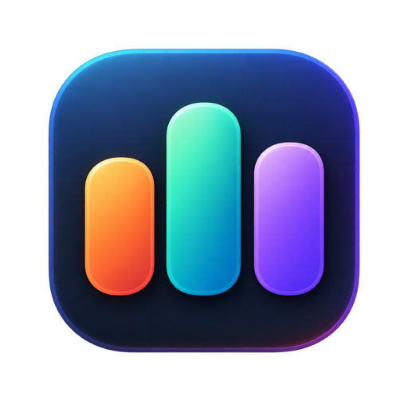
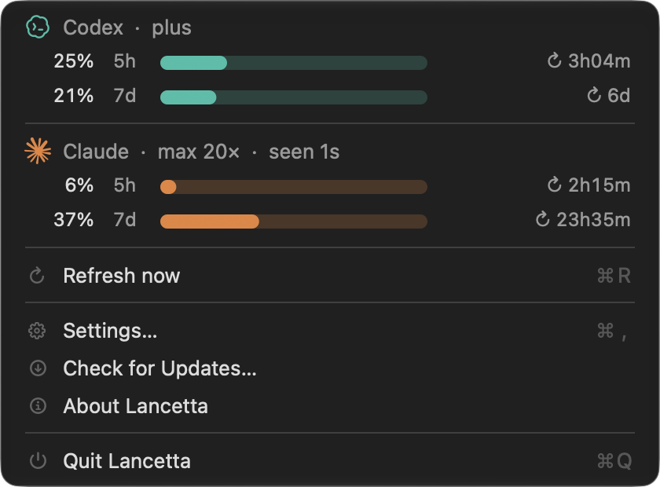

<p align="center">
  
</p>

<h1 align="center">Lancetta</h1>

<p align="center">
  <strong>A menu-bar monitor for coding agents, on macOS.</strong><br/>
  What Codex and Claude Code are spending, and what they left running — without spending a single token to find out.
</p>

<p align="center">
  
  <a href="https://www.apple.com/macos/"></a>
  <a href="LICENSE"></a>
</p>

<p align="center">
  <a href="https://lancetta.app">Website</a>
  ·
  <a href="https://lancetta.app/docs">Documentation</a>
  ·
  <a href="https://lancetta.app/docs/roadmap">Roadmap</a>
</p>

<p align="center">
  
</p>

## What is Lancetta?

A *lancetta* is the hand of an instrument — the needle that says where you are. The app answers two questions:

- **Quota** — the 5-hour and 7-day windows for **Codex** and **Claude Code**, drawn as bars, with the time each one resets and the plan each account is on.
- **Memory** — the background process trees the agents leave behind and nothing ever reaps, listed and reclaimed on your say-so.

It does it on three surfaces: the **menu bar** for the glance, the **island under the notch** for the glance that needs no mouse, and a **window** for usage over weeks, both agents in detail, and the process list.

### Reading a quota costs nothing

A monitor that spends quota in order to display quota is self-defeating, and the failure would be invisible — a few hundred tokens per poll, every forty-five seconds, is a real bite out of a five-hour window and nothing in the UI would say so. So it was measured rather than assumed:

| | before | after |
|---|---|---|
| Lifetime tokens | 318,009,023 | 318,009,023 |
| Percentages used | 33% / 13% | 33% / 13% |

Twelve account reads on one connection moved nothing. And the instrument works, which is the half that makes the zero mean something: the same counter moved by **29,188,602** across a day of ordinary use. A counter that *cannot* move looks exactly like a counter that did not.

Claude Code's side is free by construction — the app makes no request at all, because the numbers arrive in a payload Claude Code already produces for its own status line.

**Asking a model how much quota is left is a turn, and it would cost tokens on every poll.** It is the easiest route to build and the one this app will never take.

### An unknown is never a number

The defect that started the project was a status line rendering an unknown as `0%`, and a three-hour-old reading as current. So a window with no reading is drawn as *unknown*, every reading carries the time it was taken, and a source that has fallen behind its own cadence says so — a frozen number is itself an event.

## Status

**Not released yet.** v0.1 is being built, and it now carries more than it was scoped to: the menu, both agents, both windows, the notch island, the app window with the daily token chart, and the process reaper are real. The notifications and the updater are not. The first build will appear on this repository's [Releases](https://github.com/gfazioli/lancetta-website/releases) page.

## Requirements

- macOS 15 (Sequoia) or later
- Codex, Claude Code, or both. Lancetta finds them itself — a GUI app on macOS inherits almost no `PATH`, so it looks in the places these tools actually install to rather than assuming a shell.
- The notch panel needs a Mac that has a notch. On every other Mac that pane is hidden entirely and the menu-bar item behaves identically.

## Documentation

Full documentation, screenshots and FAQ at **[lancetta.app](https://lancetta.app)**.

## Trademarks

The Codex and Claude marks shown in the app are the vendors' own artwork, used **nominatively** — to name the products Lancetta reads. Lancetta is not affiliated with, or endorsed by, OpenAI or Anthropic, and one switch in Settings replaces the whole menu with neutral system symbols.

---

## About this repository

This repo hosts the **marketing site**, the **documentation** and, once there is one, the **release download** for Lancetta. The app source lives in a separate, private repository.

It runs the same Next.js 16 + Nextra 4 + Mantine 9 template as [findergit.app](https://findergit.app) and [netfox.app](https://netfox.app); a fix that lands in one is usually a candidate for the others.

```sh
yarn install
yarn dev          # dev server
yarn build        # production build + pagefind index
yarn test         # typegen, format check, lint, typecheck, jest
```

If `yarn <cmd>` answers `command not found: next` / `oxfmt`, the Yarn PATH shim is not wired on this machine — run the binary directly (`./node_modules/.bin/next dev`). `yarn test` and `yarn jest` route through the npm-run shim and work regardless.

### Before the first release

`config.app.released` is `false`, and several things key off it: the hero CTA, the release strip, the Download tab, and the `downloadUrl` / `dateModified` in the JSON-LD. Flip it in the same commit that publishes the first build, and restore the `download` entry in `app/_meta.tsx` and the footer highlight with it.

### Layout

| | |
|---|---|
| `app/` | App Router — homepage, docs route, API routes, sitemap, manifest |
| `components/` | Homepage sections, navbar, footer, release notes, structured data |
| `content/` | The MDX docs, served under `/docs` |
| `config/index.ts` | Everything site-specific: metadata, GitHub repo, app version |
| `theme.ts` | The palette, derived from the app icon |
| `theme/global.css` | Design tokens, including the two agent tints |

### Brand

The palette is the app icon's, **sampled rather than picked** — the three bars were measured off the 1254px master (a common baseline at y=907; widths 213 / 229 / 216) and `public/brand-mark.svg` redraws them from those numbers.

The brand accent is deliberately the icon's **third** bar. The other two hues already mean *which agent* inside the app — teal is Codex, orange is Claude Code — so the site keeps those semantic and takes its accent from the one the app spends on no agent. An accent borrowed from an agent hue would disagree with every screenshot on the page.

`public/favicon.svg` is a different drawing on purpose: the gradient icon does not survive 16px — measured, its bars get 66 pixels between them and its glow smears the rest — so the tab gets the icon's **flat** variant, redrawn as vector and full bleed. Details in its own comment and in [`CLAUDE.md`](CLAUDE.md).

## Licence

MIT — see [LICENSE](./LICENSE).
